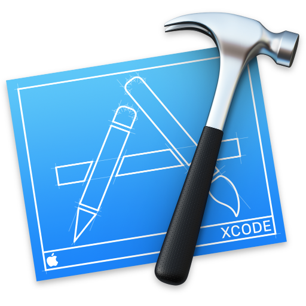
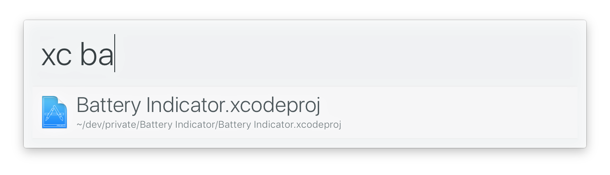

# alfred-xcode 

> [Alfred 3](https://www.alfredapp.com) workflow to open Xcode projects, workspaces, and playgrounds




## Install

```
$ npm install --global alfred-xcode
```

*Requires the Alfred [Powerpack](https://www.alfredapp.com/powerpack/).*


## Usage

In Alfred, type `xc`, press <kbd>Enter</kbd>, and then start writing a Xcode project name.


## Tip

The theme in the screenshot is [alfred-simple](https://github.com/sindresorhus/alfred-simple).


## Related

- [alfred-dark-mode](https://github.com/sindresorhus/alfred-dark-mode) - Toggle the system dark mode
- [alfred-npms](https://github.com/sindresorhus/alfred-npms) - Search for npm packages with npms.io
- [alfy](https://github.com/sindresorhus/alfy) - Create Alfred workflows with ease


## License

MIT © [Sindre Sorhus](https://sindresorhus.com)
